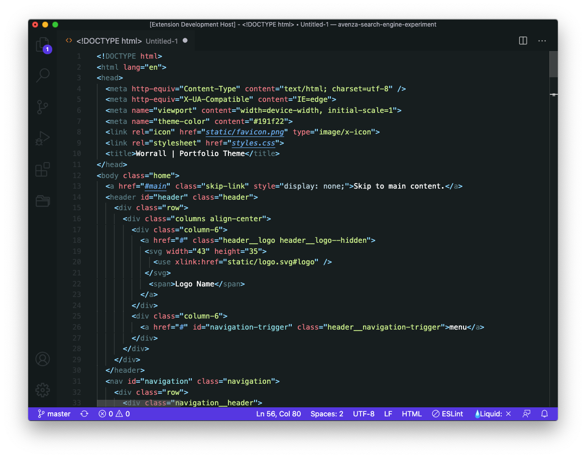
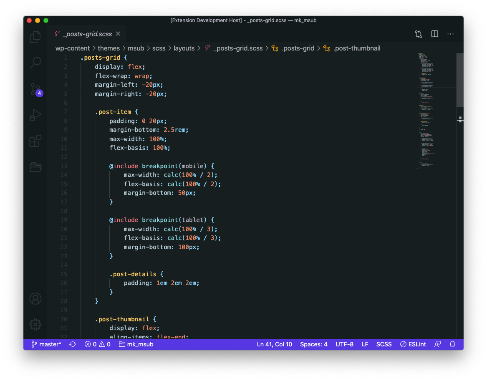
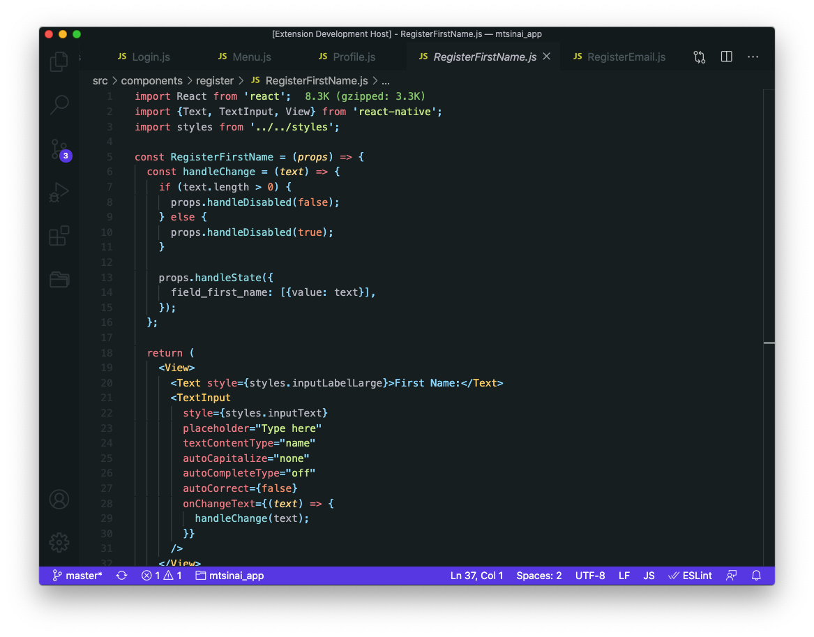
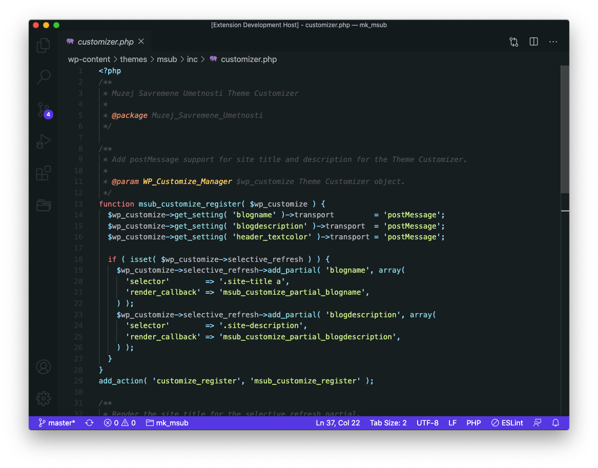
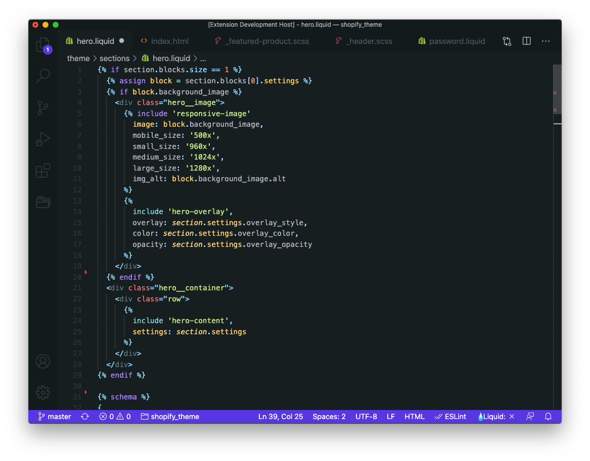

# EZRA Theme
___

Ezra is Visual Studio Code dark theme optimized for front-end development. It's minimal, pleasent for coding in any language especialy well suited for HTML, CSS/SCSS, JS/JSX, PHP (WordPress) and Liquid.

## Screenshots

### HTML

### CSS/SCSS

### JavaScript/React

### PHP

### Liquid

## Licence

Licensed under the MIT license.

